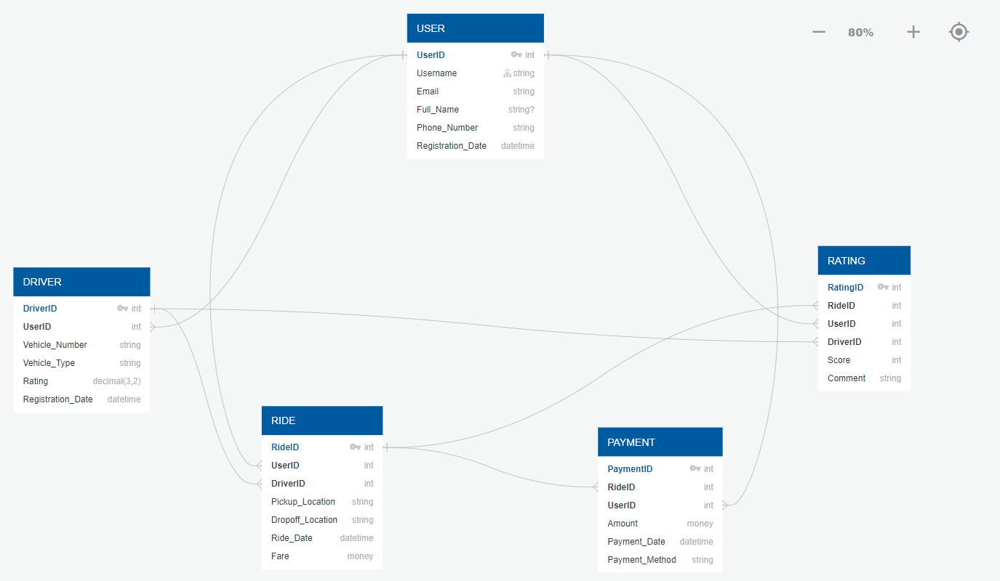

# Product Dissection of OLA – Ride-Hailing Platform
Welcome to the Product Dissection of OLA repository! This project explores the key components of OLA's ride-hailing platform, its business strategy, and the innovative solutions it offers to address real-world transportation challenges.

# Table of Contents
- Introduction
- Company Overview
- Product Dissection
- Real-World Problems Solved by OLA
- Business Strategy
- AI Initiatives
- Database Schema
- Entity-Relationship Diagram
- Conclusion

# Introduction

OLA has transformed urban transportation by providing seamless connectivity between riders and drivers. This project takes an in-depth look at OLA's data architecture and operations, explaining how the platform delivers efficient, reliable, and user-friendly ride-hailing services that millions of people rely on daily.

# Company Overview
Founded: January 2011
Founders: Bhavish Aggarwal (CEO), Ankit Bhati (CTO)
Headquarters: Bangalore, India
Mission: To provide convenient, transparent, and quick ride-hailing services through mobile and web platforms.

# Product Dissection
*Key Features of OLA:*
- User Profiles: Personalize your experience with ride history, payment options, and preferences.
- Ride Booking: Book rides with ease, select vehicle options, and see fare estimates.
- Real-time Ride Tracking: Track your ride in real-time for added safety.
- Ride Sharing: Share rides with others to reduce costs and traffic congestion.
- Cashless Payment: Pay securely using the app for a hassle-free experience.
- Driver Ratings: Rate your driver and view ratings to ensure a quality service.

# Real-World Problems Solved by OLA

1. Urban Transportation
- Challenge: Difficulty in finding safe and reliable transport.
- Solution: OLA connects passengers with nearby drivers quickly and efficiently through a user-friendly app.

2. Traffic Congestion
- Challenge: High traffic volumes increase travel time and pollution.
- Solution: OLA encourages ride-sharing, reducing the number of vehicles on the road.

3. Safety Concerns
- Challenge: Passengers and drivers require a safe environment.
- Solution: OLA offers features like real-time tracking, SOS buttons, and driver ratings to enhance safety.

4. Payment Inconveniences
- Challenge: Handling cash or complex payments.
- Solution: OLA's cashless payment system simplifies transactions and increases convenience.

5. Employment Opportunities
- Challenge: Lack of flexible job opportunities.
- Solution: OLA provides drivers the flexibility to work on their own schedule, supporting financial independence.

# OLA Business Strategy

OLA’s business strategy is built on three core pillars:

- Technological Innovation: Leveraging cutting-edge technology for a seamless user experience.
- Market Adaptability: Catering to diverse customer segments with services like OLA Micro, OLA Mini, and OLA Prime.
- Sustainability: Promoting ride-sharing and electric vehicles to reduce traffic and emissions.

# Overview of OLA's AI Initiatives

OLA has ventured into AI with its new startup, Krutrim, founded by CEO Bhavish Aggarwal. Valued at $1 billion, Krutrim focuses on AI solutions for mobility and electric vehicles.

# Schema Description

The data architecture of OLA involves multiple entities, including Users, Drivers, Rides, Payments, Ratings, and Locations. Each entity has specific attributes and relationships that facilitate the platform's seamless operations.

*Main Entities:*
- User Entity: Contains user information such as UserID, Username, Email, Phone_Number, etc.
- Driver Entity: Contains driver details like DriverID, Vehicle_Number, and Rating.
- Ride Entity: Stores ride details, including RideID, Pickup_Location, Dropoff_Location, and Fare.
- Payment Entity: Tracks payments with attributes like PaymentID, Amount, and Payment_Method.
- Rating Entity: Records user ratings for rides.
- Location Entity: Stores geographical details.

# ER Diagram
The ER diagram represents the relationships between Users, Drivers, Rides, Payments, Ratings, and Locations within OLA's database schema. It highlights how different components of the platform interact to provide seamless ride-hailing services.

# Conclusion
This project dissects the core components of OLA’s platform, revealing how it effectively addresses urban transportation challenges through innovative solutions, efficient data architecture, and a robust business strategy. By understanding its schema and data flow, we can appreciate the complexities behind OLA’s success in the ride-hailing industry.

